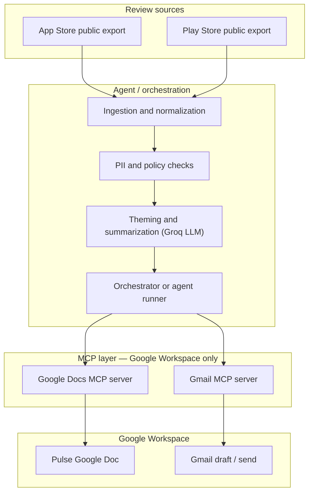
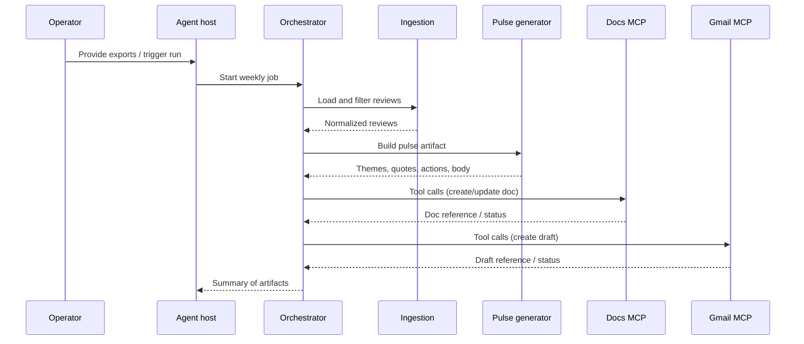

# Architecture: GROWW - Weekly Review Pulse Agent (MCP)

This document describes how the AI agent and Model Context Protocol (MCP) fit together to satisfy [the problem statement](../problemStatement.md): ingest public App Store and Play Store reviews, generate a **weekly pulse** (themes, quotes, action ideas), publish it to **Google Docs**, and notify via **Gmail**—with **all Google Workspace operations** going through **MCP servers**, not through direct Google API clients embedded in application code.

---

## 1. System context

### 1.1 Actors and external systems

| Element | Role |
|--------|------|
| **Human operator** | Provides public review exports, configures MCP in the host, may trigger runs and approve outputs. |
| **Agent host** | Environment where the orchestrator runs (IDE agent, CLI, or small service). Host loads MCP configs and exposes MCP tools to the agent. |
| **App Store / Play Store** | Source of truth for reviews **only** via **public** export pathways permitted by the brief (no authenticated scraping). |
| **Google Docs** | Canonical place for the one-page weekly pulse document. |
| **Gmail** | Channel for a **draft** (or send, if policy allows) containing the same substance as the pulse. |
| **Google Docs MCP server** | Bridges host ↔ Docs using MCP (tool list, tool calls). |
| **Gmail MCP server** | Bridges host ↔ Gmail the same way. |

The **business stakeholders** (product, support, leadership) do not appear as runtime components; they **consume** the Doc and email artifacts.

### 1.2 Architectural principle: MCP as the Workspace boundary

Anything that **creates or mutates** Docs content or Gmail messages for this milestone must go through **MCP tool invocations** on configured servers. The intent is to centralize OAuth/API complexity inside the MCP implementations and keep the agent’s own code free of parallel “shortcut” clients to the same Google APIs.

**In scope for “no direct API”:** Google Docs API and Gmail API usage **as callable from your repo’s orchestration layer**. A third-party **MCP server** may itself use Google libraries internally—that is expected. Your *application* must not duplicate those calls for the same operations.

**Out of scope for that rule:** Ingesting review files from disk, calling a language model, or pure data transforms—those are not Google Workspace APIs.

---

## 2. Goals and quality attributes

### 2.1 Functional goals (from the brief)

| Goal | Implication |
|------|-------------|
| One-page weekly pulse | Structured narrative: top themes, user quotes, action ideas; short enough to scan in one screen where applicable. |
| Pulse in Docs | **Google Docs MCP** creates or updates the document that is the **system of record** for the note. |
| Email handoff | **Gmail MCP** produces a draft (minimum) with aligned content; sending is optional depending on policy and eval criteria. |
| Theming discipline | Internally group into **≤5** themes; surface **top 3** in the output. Exactly **3** quotes and **3** action ideas. |
| Compliance | **Public** review sources only; **no** usernames, emails, or IDs in exported artifacts; **≤250 words** for the pulse body per brief. |

### 2.2 Non-functional goals

| Attribute | Target |
|-----------|--------|
| **Reproducibility** | Same inputs and configuration → same logical steps; Doc and email content traceable to a defined run. |
| **Auditability** | MCP tool names and outcomes can be logged without leaking secrets or raw PII. |
| **Security** | Credentials for Google live in host/MCP config or secret stores—not in the repository. |
| **Maintainability** | Clear separation: data pipeline vs pulse generation vs MCP calls vs operational runbook. |

---

## 3. Logical architecture

High-level data and control flow from review files to Workspace artifacts:

### 3.1 Alternative view: sequence (conceptual)

---

## 4. Component responsibilities

### 4.1 Orchestration / agent

- **Sequences** the pipeline: establish time window (8–12 weeks) → ingest → theme and summarize → enforce guards → call Docs MCP → call Gmail MCP.
- **Selects** which tools to use: local/file ingestion and analysis are **not** required to be MCP unless you choose that pattern; **Docs and Gmail must be MCP** for this milestone.
- **Maps** the pulse artifact into parameters each MCP server expects (title, body text, document identifier strategy, recipient addresses for drafts).
- **Handles** user-visible failure: missing files, empty review sets, MCP auth expiry—surfacing actionable messages without dumping tokens.

### 4.2 Ingestion

- **Inputs:** Files or blobs from **public** App Store and Play Store export processes documented for your product.
- **Behavior:** Parse, normalize field names, parse dates, filter by cutoff and horizon, deduplicate if the export overlaps weeks.
- **Outputs:** A **normalized review list** (rating, title, body, date) suitable for downstream analysis. Optional: persistent cache file for debugging (with PII policy applied).

### 4.3 Analysis / pulse generation

- **LLM Provider & Rate Limit Mitigation:** Groq (`llama-3.3-70b-versatile`) is the designated LLM. Due to strict rate limits (12K Tokens/min, 100K Tokens/day), the architecture employs **Stratified Token Budgeting**. The review payload is sampled and truncated to a strict maximum of ~6,000 tokens per run, prioritizing 1- and 2-star reviews to extract actionable insights without hitting the 12K TPM limit.

- **Theming:** Assign reviews to **at most five** internal buckets; rank or score so the note can highlight **three** themes.
- **Quotes:** Choose **three** short excerpts; redact or paraphrase so no **PII or identifiers** leak.
- **Actions:** Produce **three** actionable items tied to themes (product/process—not generic filler).
- **Formatting:** Emit a **single pulse body** meeting **≤250 words** and readability (headings, bullets) as needed for Docs and email.

### 4.4 Guardrails

- **PII / identifiers:** Blocklist patterns (emails, @handles, long digit runs if policy requires).
- **Length:** Reject or trim pulse body to satisfy word limit.
- **Source policy:** Ingestion refuses reliance on login-only or ToS-violating scraping.

### 4.5 MCP layer (mandatory for Workspace)

| Server | Typical responsibilities |
|--------|---------------------------|
| **Google Docs MCP** | Create doc, set title, insert or replace sections, optionally share or move to a folder if tools exist. |
| **Gmail MCP** | Create draft with subject, body, recipients; optional send if your process requires “send to self” explicitly. |

The host process starts these servers (or connects to them) per MCP configuration; the **orchestrator invokes tools by name** with structured arguments rather than embedding HTTP calls to Google in its own modules for the same operations.

---

## 5. Data artifacts and lifecycle

| Stage | Artifact | Notes |
|-------|-----------|------|
| Raw | Store export files | Treat as sensitive operational data; not necessarily committed. |
| Normalized | Review records | Stable schema for Phase 2; dates in a comparable format (UTC or local with explicit TZ policy). |
| Pulse | Structured pulse | Themes (top 3), quotes (3), actions (3), body text, metadata (run date, product name only if non-identifying). |
| Published | Google Doc | Long-lived; versioning strategy (same doc weekly vs new doc per week) is a [decision](./decision.md) item. |
| Notification | Gmail draft | Should mirror Doc substance; subject line convention is a decision. |

---

## 6. Trust boundaries and data classification

| Boundary | What crosses it | Rules |
|----------|-----------------|--------|
| Export file → host filesystem | Review text | Public-only sources; no credentials in filenames. |
| Host → analysis | Normalized reviews | Strip obvious PII early if possible. |
| Analysis → MCP | Title, body, recipients for Gmail | No secrets; no user IDs from reviews. |
| MCP → Google | OAuth-backed API calls inside MCP | Tokens never logged by orchestrator in plain text. |

---

## 7. Failure modes and operational behavior

| Failure | Mitigation direction |
|---------|---------------------|
| Empty or stale exports | Detect low row counts; fail fast with message to operator. |
| MCP server not running | Pre-flight check; document start order in runbook. |
| OAuth expired | Human re-auth in host; document in Phase 3 eval. |
| Partial MCP success (Doc OK, Gmail fails) | Idempotent retry for Gmail; log Doc link so work is not lost. |
| Pulse over word limit | Regenerate or truncate with explicit marker (prefer regeneration to preserve quality). |

---

## 8. Configuration and observability

### 8.1 Configuration surfaces

| Concern | Where it lives |
|--------|----------------|
| MCP server launch, env vars, OAuth | Host configuration and local secret stores—**never committed** as cleartext secrets. |
| Product label, theme hints, word limits | Repo-safe config or prompts. |
| Export paths, date ranges | Run parameters or a small config file. |

### 8.2 Logging

- Log **run id**, **counts** of reviews, **theme names**, **MCP tool names**, **success/failure**—not raw review bodies in production logs if avoidable.
- When debugging is enabled, restrict log retention and access.

---

## 9. Deployment views (pick what matches your host)

| Deployment | Description |
|------------|-------------|
| **Interactive** | Operator runs the agent in an IDE; MCP servers are child processes of the IDE or local CLI. |
| **Batch** | Scheduled job invokes the same orchestrator binary with exports on disk; MCP servers still required for Docs/Gmail. |

The architecture does **not** require a specific language; it requires **clear modular boundaries** and **MCP for Workspace**.

---

## 10. Future extensions (out of scope unless the brief changes)

- Fully automated weekly schedule and alerting on failure.
- Additional MCP servers (calendar, Slack, ticketing).
- Multi-product or multi-region review merging with attribution controls.

---

## Related documents

- [Phase-by-phase implementation plan](./phase-by-implementationplan.md)
- [Decisions log](./decision.md)
- Per-phase [evaluation criteria](./phases/) (`eval.md` under each phase folder)
- Phase 1 runnable ingest & contract: [`../phases/phase-01-data-and-compliance/README.md`](../phases/phase-01-data-and-compliance/README.md), [`../phases/phase-01-data-and-compliance/DATA_CONTRACT.md`](../phases/phase-01-data-and-compliance/DATA_CONTRACT.md)
