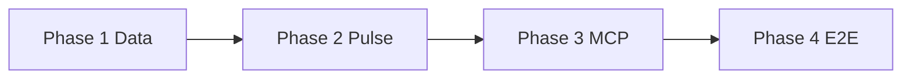

# Phase-by-phase implementation plan

This plan breaks down building the **weekly review pulse** AI agent with **MCP for Google Docs and Gmail**, aligned with [problemStatement.md](../problemStatement.md) and [architecture.md](./architecture.md).  

**Convention:** Each phase lists **inputs**, **activities**, **outputs**, **risks**, and **gates**. This document stays at the **what and why** level—it does not specify exact code, frameworks, or line-level implementation. Use the matching **`eval.md`** in each phase folder for testing and exit criteria before moving on.

---

## Phase overview

| Phase | Focus | Evaluation |
|------|--------|------------|
| 1 | Data ingestion, review window, public-data and PII rules | [phase-01 eval](./phases/phase-01-data-and-compliance/eval.md) |
| 2 | Theming, pulse content (top 3 themes, quotes, actions), length limits | [phase-02 eval](./phases/phase-02-pulse-generation/eval.md) |
| 3 | Google Docs MCP + Gmail MCP wiring, authentication, first real artifacts | [phase-03 eval](./phases/phase-03-mcp-workspace/eval.md) |
| 4 | End-to-end orchestration, repeatability, handoff to operators | [phase-04 eval](./phases/phase-04-e2e-and-operations/eval.md) |

---

## Phase 1 — Data and compliance

### Purpose

Establish a **trusted, repeatable** pipeline from **public** store review exports into a **normalized** dataset that respects the product’s **time window**, **field completeness**, and **no-PII** constraints. Until this is solid, downstream “insights” are unreliable or non-compliant.

### Inputs

- Product identity from Milestone 1 (which app’s reviews).
- One or more **export formats** from App Store and Play Store **public** flows (documentation links, sample column headers, date formats).
- Policy decisions already captured in [decision.md](./decision.md): what counts as an allowed public export, timezone handling, and retention of raw files.

### Activities

1. **Source inventory**  
   - List every way you **legitimately** obtain review CSV/JSON (vendor export, periodic download, etc.).  
   - Explicitly exclude: scraping behind developer logins, third-party grey-market feeds, or anything that violates store terms.

2. **Schema mapping**  
   - Map store-specific columns to a **canonical** shape: at minimum **rating**, **title**, **text/body**, **review date**.  
   - Document unresolved fields (e.g., “device” optional) and how missing data is handled.

3. **Time window**  
   - Define how you compute “**last 8–12 weeks**” (calendar weeks vs rolling 56–84 days, timezone anchor).  
   - Filter records so nothing outside the chosen window enters Phase 2.

4. **Quality checks**  
   - Detect duplicate reviews across exports.  
   - Flag empty bodies, obvious spam, or corrupt rows with clear counters.

5. **PII and identifier posture**  
   - Decide what to do with reviewer display names in source data: drop before Phase 2, hash, or never pass through.  
   - Ensure the **normalized** payload does not carry raw usernames or emails into later stages.

6. **Reproducibility**  
   - Version the mapping doc when export format changes.  
   - Keep a **sanitized** fixture (fake data) for tests if you cannot commit real exports.

### Outputs

- Written **data contract** (fields, types, optional vs required).  
- Runnable **ingestion** path from export file(s) to normalized output (file or stable API between components as you prefer).  
- A short **operator note**: where to place exports, how often to refresh, and what “good” row counts look like.

**Implementation in this repo:** [`phases/phase-01-data-and-compliance/`](../phases/phase-01-data-and-compliance/README.md) (Python package `review_ingest`, CLI `review-ingest`, JSONL output per `DATA_CONTRACT.md`).

### Risks and mitigations

| Risk | Mitigation |
|------|------------|
| Export format drifts | Version mapping; alert on unexpected columns. |
| Timezone ambiguity | Fix a single policy (UTC vs local) in decision.md. |
| Accidental PII carryover | Automated or checklist scan on normalized output. |

### Gate to Phase 2

- Normalized dataset is **stable**, **documented**, and passes **Phase 1 exit criteria** in [eval](./phases/phase-01-data-and-compliance/eval.md).  
- No reliance on non-public review access.

---

## Phase 2 — Pulse generation

### Purpose

Turn normalized reviews into the **weekly pulse artifact**: **≤5** internal themes, **top 3** themes in the note, **3** quotes, **3** actions, and a **≤250 word** scannable body—with **no** prohibited identifiers in text.

### Inputs

- Normalized review list from Phase 1.  
- Optional: glossary of product areas (onboarding, KYC, payments, …) to bias theme names toward business language.  
- [architecture.md](./architecture.md) constraints on structure and length.

### Activities

1. **Theme model**  
   - **Stratified Sampling for Groq Limits:** Before sending data to Groq (`llama-3.3-70b-versatile`), implement a sampling strategy to ensure the prompt stays well under the 12K TPM (Tokens Per Minute) limit. Target a strict budget of ~6,000 input tokens.
   - **Theme model:** Use **LLM-assisted grouping** (via **Groq**) on this sampled dataset to extract themes. Bias the sampling towards 1-star and 2-star reviews, as they contain the most actionable issues.
   - Cap **active theme buckets at five** for grouping; **surface three** in the final note ranked by volume, sentiment severity, or business priority (document the ranking rule).

2. **Quote selection**  
   - Rules for **diversity** (not three quotes from the same sub-issue unless justified).  
   - Rules for **anonymization**: paraphrase vs short generic excerpt if original text contains names or handles.

3. **Action ideas**  
   - Each action should map to a **theme** and be **specific** (owner-type hints like “product”, “support playbook”, “comms” are fine; avoid vague “improve app”).

4. **Pulse assembly**  
   - Single **body** suitable for both Google Doc and email (or a thin wrapper for subject line only in email).  
   - Enforce **≤250 words** for the pulse body; decide whether titles/headers count toward the limit and document it.

5. **Verification loop**  
   - Manual or automated review of sample outputs for **theme count**, **quote count**, **action count**, **word count**, and **PII patterns**.

6. **Handoff contract**  
   - Define the **stable structure** passed to Phase 3 (plain text, markdown sections, or a small schema). Subject line pattern for email is optional but recommended as a field.

### Outputs

- Documented **generation procedure** (repeatable by another teammate).  
- **Golden references** (sanitized) or checklists proving constraints are met.  
- **Pulse artifact specification** agreed with Phase 3.

### Risks and mitigations

| Risk | Mitigation |
|------|------------|
| Themes feel arbitrary | Anchor names to product vocabulary; sanity-check with a PM. |
| Quotes still contain PII | Second-pass redaction layer or stricter quote selection rules. |
| Word limit fights readability | Prioritize one-page scannability; move detail to “appendix” only if brief allows |

### Gate to Phase 3

- Phase 2 **eval** passed; pulse payload is **stable** enough to parameterize Docs and Gmail MCP calls.

---

## Phase 3 — MCP (Google Docs + Gmail)

### Purpose

Connect the host environment to **real** Google Workspace outcomes using **only** the **Docs MCP** and **Gmail MCP** tool surfaces for those operations, including **authentication** and **first successful Doc + draft**.

### Inputs

- Pulse artifact schema from Phase 2.  
- Chosen MCP server implementations (vendor packages or internal servers—record in [decision.md](./decision.md)).  
- Google Cloud / OAuth prerequisites per your MCP docs (consent screen, scopes, test users).

### Activities

1. **MCP selection and scoping**  
   - Confirm the Docs MCP exposes tools you need: **create/update** document, insert body, optional formatting.  
   - Confirm Gmail MCP supports **draft creation** and, if required, **send**.

2. **Host configuration**  
   - Register MCP servers in the host (launch command, working directory, env).  
   - Store **client secrets** and tokens outside the repo; reference them via env or host secret UI.

3. **Authentication**  
   - Walk through OAuth consent (or workspace-domain flow if applicable).  
   - Document **token refresh** and what the operator does when auth expires mid-run.

4. **First integrated calls**  
   - **Dry run**: smallest viable Doc update with placeholder text.  
   - **Pulse run**: push **real** pulse body from Phase 2 into a Doc; create **Gmail draft** with matching content.

5. **Boundary audit**  
   - Verify the orchestration path for Docs/Gmail does **not** add parallel direct API clients for the same operations; note any **exceptions** in `decision.md` with rationale.

6. **Operational metadata**  
   - Decide **document naming** (e.g., “Weekly pulse — 2026-05-10”) and **draft recipient** conventions.  
   - Capture **document IDs** or URLs in logs at **info** level without secrets.

### Outputs

- Redacted **MCP configuration** documentation (what keys exist, not their values).  
- Evidence of **one successful Doc write** and **one successful Gmail draft** (screenshots or redacted logs acceptable).  
- Short **troubleshooting** section: common MCP errors and fixes.

### Risks and mitigations

| Risk | Mitigation |
|------|------------|
| Scope mismatch (MCP missing a feature) | Record gap; either extend MCP server or adjust pulse format within tool limits. |
| Auth friction in shared environments | Use a dedicated test account or workspace. |
| Confusion between MCP and direct SDK | Code review + decision log entry |

### Gate to Phase 4

- Phase 3 **eval** complete; Workspace artifacts provably produced **via MCP tools**.

---

## Phase 4 — End-to-end and operations

### Purpose

Combine Phases **1–3** into a **single repeatable run**, clarify **who runs it when**, and align shipped behavior with [architecture.md](./architecture.md) and the **problem statement**. Close loose ends in **decision.md** as you finalize operational trade-offs.

### Inputs

- All prior phase outputs and passing **evals**.  
- Optional: schedule requirements (still **manual** weekly run is acceptable unless you add automation).

### Activities

1. **End-to-end choreography**  
   - One defined **start** (export files ready → finished Doc + draft) with **no manual copy-paste** of the pulse body unless eval allows an explicit exception.  
   - Order: ingest → pulse → Docs MCP → Gmail MCP (same as architecture; adjust only if you document why).

2. **Repeatability**  
   - Second run **updates** the same Doc policy or **creates a new** Doc per week—pick one and document side effects.  
   - Ensure a new week does not **corrupt** prior content unintentionally.

3. **Regression bundle**  
   - Re-check **PII**, **theme count**, **250 words**, and **MCP-only** Workspace access on the **full** pipeline output.

4. **Runbook**  
   - Prerequisites, estimated duration, failure messages, and **who to contact**.  
   - Where outputs live (Doc URL pattern, Gmail folder for drafts).

5. **Documentation sync**  
   - Update **architecture** if as-built differs (e.g., extra MCP for filesystem).  
   - Record any **new** tech or business decisions in [decision.md](./decision.md).

6. **Demo / milestone readiness**  
   - Storyline for stakeholders: what the Doc contains and how the email supports the weekly ritual.

### Outputs

- **Runbook** (operator-facing).  
- **Evidence pack** for the milestone: links or screenshots of Doc + Gmail draft, plus a pointer to logs or eval sign-offs.  
- **Final** pass on decision log and open risks.

### Risks and mitigations

| Risk | Mitigation |
|------|------------|
| “Works on my machine” | Second person runs the runbook unassisted once. |
| Scope creep (automation, dashboards) | Defer to future work; keep milestone aligned to brief. |

### Gate to “done”

- Phase 4 **eval** satisfied and problem statement **acceptance checklist** complete.

---

## Cross-phase concerns

| Topic | Where it is handled |
|--------|---------------------|
| PII | Phase 1–2 primary; regression in Phase 4 |
| Word limit and theme counts | Phase 2 primary; regression in Phase 4 |
| MCP-only Workspace | Phase 3 primary; audit in Phase 4 |
| Secrecy / credentials | All phases; never commit secrets |
| Record of trade-offs | [decision.md](./decision.md) |

---

## Related documents

- [Architecture](./architecture.md)  
- [Decisions](./decision.md)  
- Phases: [phase-01](./phases/phase-01-data-and-compliance/eval.md), [phase-02](./phases/phase-02-pulse-generation/eval.md), [phase-03](./phases/phase-03-mcp-workspace/eval.md), [phase-04](./phases/phase-04-e2e-and-operations/eval.md)
